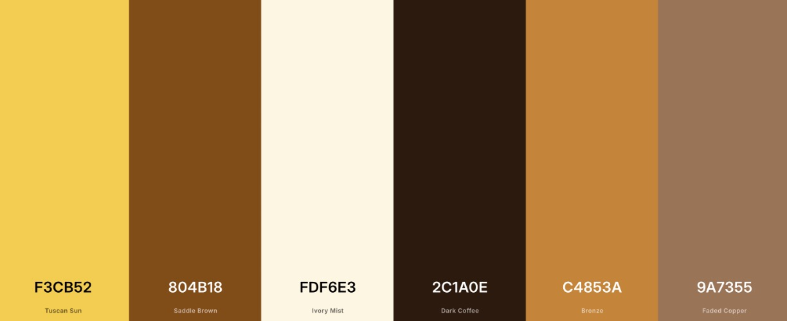

## Colors:

--custard-yellow: #F3CB52;
--custard-brown: #804b18;
--custard-cream: #FDF6E3;
--custard-dark: #2C1A0E;
--custard-light-brown: #C4853A;
--custard-muted: #9A7355;

## Word Colors

--custardWord: #7f4c1e;
--UIWord: #d79921;
--CustardUIBackground: #fef6e3;

